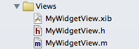
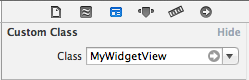

MHNibLoading
============

MHNibLoading aims to eliminate some of boilerplate code commonly seen when loading UIViews from a nib on disk. The library is most useful when the UIView subclass and it's corresponding nib file have the same name.  It provides category methods on UIView to load either individual UIView instances or UINib instances from on-disk *.xib files. 

# Usage

### Setup

Create your *.xib file, its corresponding UIView subclass, and set the class identity for the *.xib file in the Xcode Identity Inspector.  If you want to take advantage of implicit nib loading, make sure to give the *.xib file and your UIView subclass the same name.  For example, `MyWidgetView.xib` and `MyWidgetView.[h,m]`.





### Code

Usage is as follows

```objc

@implementation MyWidgetController

- (void)loadView
{
	// Basic usage
	self.view = [MyWidgetView loadInstanceFromNib];

	// For special cases (e.g., instantiating 100s of views), UINibs can be created too
	UINib *nib = [MyWidgetView loadNib];
	UIView *myWidgetView = [nib instantiateWithOwner:self options:nil];
}

@end

```